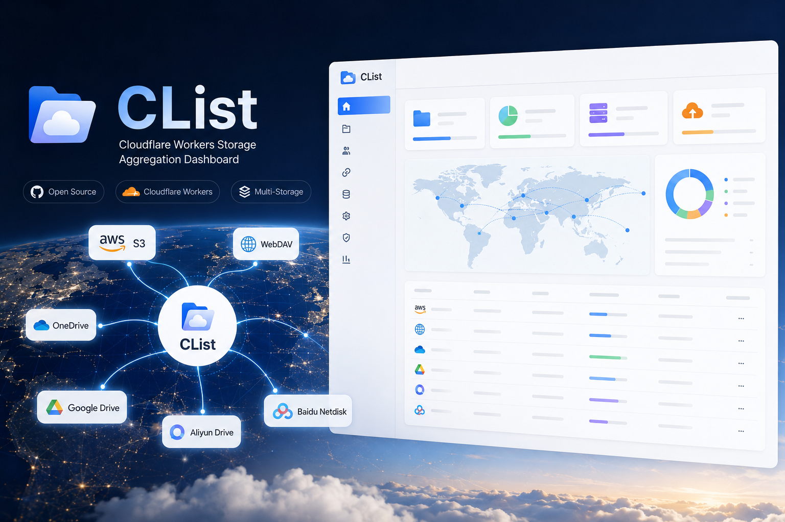
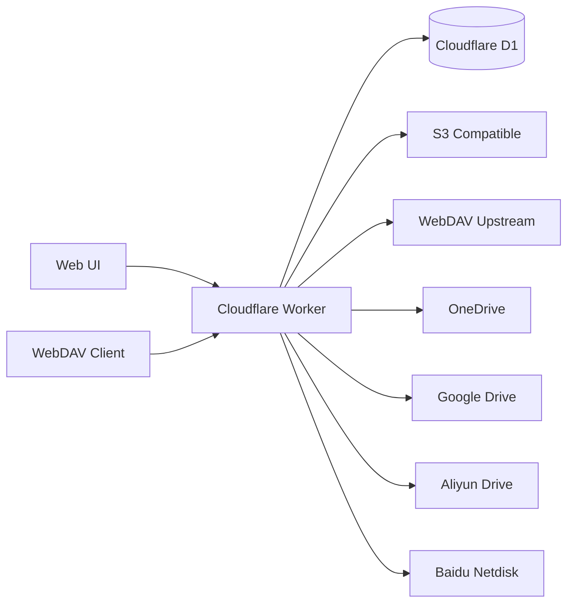

# CList

<p align="center">
  <strong>A Cloudflare-native storage aggregation panel with WebDAV, multi-drive support, file preview, sharing, audit logs, and admin controls.</strong>
</p>

<p align="center">
  <a href="./README_zh-CN.md">简体中文</a>
  ·
  <a href="./docs/deployment.md">Deployment</a>
  ·
  <a href="./docs/webdav.md">WebDAV</a>
  ·
  <a href="./GITHUB_WORKFLOW_DEPLOY.md">GitHub Actions</a>
</p>

<p align="center">
  <a href="https://github.com/ooyyh/Cloudflare-Clist/stargazers">
    
  </a>
  <a href="https://github.com/ooyyh/Cloudflare-Clist/network/members">
    
  </a>
  <a href="https://github.com/ooyyh/Cloudflare-Clist/blob/master/LICENSE">
    
  </a>
  <a href="https://workers.cloudflare.com/">
    
  </a>
  <a href="https://www.typescriptlang.org/">
    
  </a>
</p>

<p align="center">
  
</p>

## Overview

CList turns Cloudflare Workers + D1 into a lightweight cloud storage aggregation service. It gives you a single web UI and WebDAV endpoint for S3-compatible storage, WebDAV servers, OneDrive, Google Drive, Aliyun Drive, and Baidu Netdisk.

It is designed for small personal data centers, public download mirrors, private file hubs, and edge-hosted storage dashboards where running a traditional server is overkill.



## Highlights

- Multi-storage file browser with public and private permission controls
- WebDAV server endpoint for desktop sync tools, mobile file managers, and CLI clients
- S3-compatible storage support, including custom endpoint and base path
- Drive integrations for OneDrive, Google Drive, Aliyun Drive, and Baidu Netdisk
- File upload, download, folder creation, rename, move, copy, and delete workflows
- Preview support for common text, markdown, code, image, audio, video, and document files
- Public share links with token-based access
- Storage statistics with visual charts for total size, file count, folder count, and file type distribution
- Audit logs for admin actions and file operations
- Cloudflare D1 persistence and Workers edge deployment
- GitHub Actions deployment guide for repeatable releases

## Supported Backends

| Backend | Browse | Upload | Rename / Move | Notes |
| --- | --- | --- | --- | --- |
| S3 compatible | Yes | Yes | Yes | Works with R2-like and S3-compatible endpoints |
| WebDAV upstream | Yes | Yes | Yes | Also exposed through CList's own WebDAV server |
| OneDrive | Yes | Yes | Yes | Supports online refresh API or custom OAuth app |
| Google Drive | Yes | Yes | Yes | Supports online refresh API or custom OAuth app |
| Aliyun Drive | Yes | Yes | Yes | Uses Aliyun Open API style token refresh |
| Baidu Netdisk | Yes | Yes | Yes | Supports refresh token based access |

## Quick Start

### 1. Clone and Install

```bash
git clone https://github.com/ooyyh/Cloudflare-Clist.git
cd Cloudflare-Clist
npm install
```

### 2. Create a D1 Database

```bash
npx wrangler login
npx wrangler d1 create clist
```

Keep the returned `database_id`; it is used in the next step.

### 3. Configure Wrangler

Create your production config from the example:

```bash
cp wrangler.jsonc.example wrangler.jsonc
```

Then copy the D1 `database_id` returned by Wrangler into `wrangler.jsonc`.

Recommended production shape:

```jsonc
{
  "$schema": "node_modules/wrangler/config-schema.json",
  "name": "clist",
  "main": "./workers/app.ts",
  "compatibility_date": "2025-04-04",
  "keep_vars": true,
  "d1_databases": [
    {
      "binding": "DB",
      "database_name": "clist",
      "database_id": "your-d1-database-id",
      "migrations_dir": "./migrations"
    }
  ]
}
```

Use Cloudflare Dashboard or Wrangler secrets/vars for runtime values. Keeping `keep_vars: true` avoids overwriting Dashboard-managed variables during deploys.

### 4. Apply Database Migrations

```bash
npx wrangler d1 migrations apply clist --remote
```

### 5. Deploy

```bash
npm run build
npx wrangler deploy
```

## Environment Variables

| Variable | Required | Example | Description |
| --- | --- | --- | --- |
| `DB` | Yes | D1 binding | Cloudflare D1 database binding |
| `ADMIN_USERNAME` | Yes | `admin` | Admin login username |
| `ADMIN_PASSWORD` | Yes | `change-me` | Admin login password |
| `SITE_TITLE` | No | `CList` | Site title shown in the UI |
| `SITE_ANNOUNCEMENT` | No | `Welcome` | Announcement text shown to visitors |
| `CHUNK_SIZE_MB` | No | `10` | Browser upload chunk size |
| `WEBDAV_ENABLED` | No | `true` | Enables the WebDAV server endpoint |
| `WEBDAV_USERNAME` | No | `webdav` | WebDAV username; falls back to admin username |
| `WEBDAV_PASSWORD` | No | `secret` | WebDAV password; falls back to admin password |

## WebDAV

When `WEBDAV_ENABLED` is set to `"true"`, CList exposes storage backends through WebDAV:

```text
https://your-domain.example/dav/0/            # all storages
https://your-domain.example/dav/{storageId}/  # one storage
```

Important details:

- WebDAV URLs should end with a trailing slash.
- Use Basic Auth with `WEBDAV_USERNAME` / `WEBDAV_PASSWORD`.
- Desktop clients such as Windows WebDAV, macOS Finder, Cyberduck, RaiDrive, NetDrive, and many mobile file managers can connect directly.
- CList supports `OPTIONS`, `PROPFIND`, `GET`, `HEAD`, `PUT`, `DELETE`, `MKCOL`, `COPY`, and `MOVE`.

More details: [docs/webdav.md](./docs/webdav.md)

## Drive Configuration Notes

CList follows the OpenList-style driver flow for cloud drive token refresh:

- Online refresh API is enabled by default for OneDrive, Google Drive, Aliyun Drive, and Baidu Netdisk.
- Existing OpenList-style `api_url_address` values are accepted alongside CList's `api_address`.
- If no local `client_id` and `client_secret` are configured, CList automatically falls back to the online refresh API.
- Refreshed tokens are persisted into storage state so repeated browsing does not require re-login.

## Development

```bash
npm run dev
```

Useful checks:

```bash
npm run build
npm run typecheck
npx wrangler deploy --dry-run
```

## Project Structure

```text
app/
  components/        React components
  lib/               storage clients, auth, audit, utilities
  routes/            React Router routes and API endpoints
workers/
  app.ts             Cloudflare Worker entry
migrations/          D1 migrations
docs/                deployment and WebDAV docs
public/              static assets
```

## Documentation

- [Deployment Guide](./docs/deployment.md)
- [Configuration Guide](./docs/configuration.md)
- [WebDAV Guide](./docs/webdav.md)
- [GitHub Actions Deployment](./GITHUB_WORKFLOW_DEPLOY.md)

## Star History

<a href="https://www.star-history.com/#ooyyh/Cloudflare-Clist&Date">
  <picture>
    <source media="(prefers-color-scheme: dark)" srcset="https://api.star-history.com/svg?repos=ooyyh/Cloudflare-Clist&type=Date&theme=dark" />
    <source media="(prefers-color-scheme: light)" srcset="https://api.star-history.com/svg?repos=ooyyh/Cloudflare-Clist&type=Date" />
    
  </picture>
</a>

## Support

- GitHub Issues: [ooyyh/Cloudflare-Clist/issues](https://github.com/ooyyh/Cloudflare-Clist/issues)
- Author: [@ooyyh](https://github.com/ooyyh)
- Email: laowan345@gmail.com

## License

CList is released under the [MIT License](./LICENSE).
